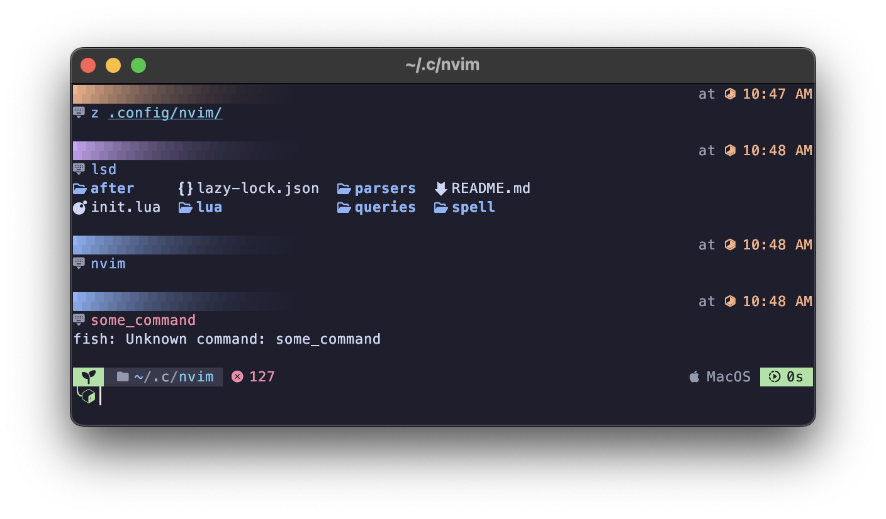

# 🐟 Fish



Configuration files for the `Friendly interactive shell`(fish) to be used in `MacOS` & `Termux`.

## 📦 Requirements

- `Zoxide`.

## 🤔 What's included?

- Basic setup for `termux-x11`.
- Basic setup for `Zoxide`.
- Fancy man page viewer.
- Custom prompt(with transience).
- Modified `Catppuccin-mocha` theme for fish.

## 💡 Prompt

A custom prompt is available. It has,

- Current mode.
- Current directory.
- Last exit code/status.
- Platform(WIP).
- Last command execution duration.
- Transient prompt.
- Time of execution(timestamp).

The relevant files are,

- [functions/fish_prompt.fish](./functions/fish_prompt.fish)
  The function that creates the prompt.

- [functions/fancy_path.fish](./functions/fancy_path.fish)
  Used for creating the path section. It truncates path segments & colors them.

- [functions/fancy_timestamp.fish](./functions/fancy_timestamp.fish)
  Used for creating the timestamp.

- [functions/get_status.fish](./functions/get_status.fish)
  Used for creating the exit code section(shown right after the path).

- [functions/gradient.fish](./functions/gradient.fish)
  Generates gradient between 2 colors

- [functions/platform.fish](./functions/platform.fish)
  Shows current platform.

- [functions/vi_mode.fish](./functions/vi_mode.fish)
  Used for getting decorations for the current mode.

------

- [conf.d/spacer.fish](./conf.d/spacer.fish)
  Adds spacing between each command output.

- [conf.d/transient.fish](./conf.d/transient.fish)
  Transient prompt setup.

## 💡 Man page decorations

Decorations for man pages are provided from [functions/man.fish](./functions/man.fish).

## 💡 Generate completions

Run this command to make fish update the completion,

```fish
fish_update_completions
```

